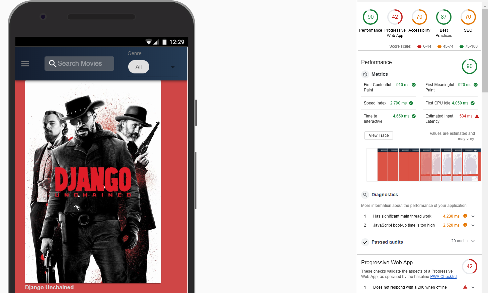

## 🎓 Initial Approach

This peoject has some deciding metrics that helped me to use a powerful tech stack. When I read `optimsation, responsive, performance` keywords in the given task, I started to looking for various approaches that could work with ReactJS in order to provide meet all these requirments. After spending some time in gathering information, I decided to chose GatsbyJS ( a static site generator of React Apps).

These are following reasons: 

- **Go Beyond Static Websites.** Gatsby sites are fully functional React apps so we can create high-quality,
  dynamic web apps.

- **Performance comes with Gatsby** Ace your performance audits by default. Gatsby automates code
  splitting, image optimization, inlining critical styles, lazy-loading, and prefetching resources,
  and more to ensure your site is fast — no manual tuning required.

- **Gatsby sites don’t require servers**.

## 🚀 Motivation

1.  **💪Blazingly fast development of React Apps**

- When I started reading Gatsby docs, It caught my attention as it does two jobs - static page creation - fully funtional react apps

- To be more precise, once the static page gets loaded, gatsby turns it into a react page to embed dynamic behaviour.
- Gatsby provides PWA, code splitting and lazy loading out of the box.
- Server side rendering react apps provides better UX for static content.
- Better SEO results

2.  **Image optimisaton**

- Image optimisation is one of the hardest task while building websites. The janky experience could lead to bad UX. So after figuring out many possible approaches, I decided to prefetch all images with GraphQL which embeds all data at build time.
- I used `Gatsby-Images` which is on most popular plugins list in Gatsby Ecosystem. It works seamlessly with Gatsby image processing techniques with GraphQL.

3. **Redux Architechure**

- gatsby is built on Redux as it helps to override all actions when they get dispatched during compiling its build. I used `onCreatePage` and `onCreateNode` to manipulte page creation behaviour and data fetching from REST API of `theMovieDB`.

## 🤝 Audits

After running Google lighthouse audits, the results were outstanding for the basic prototype:

- All audits categories met the satisfactory criteria.

